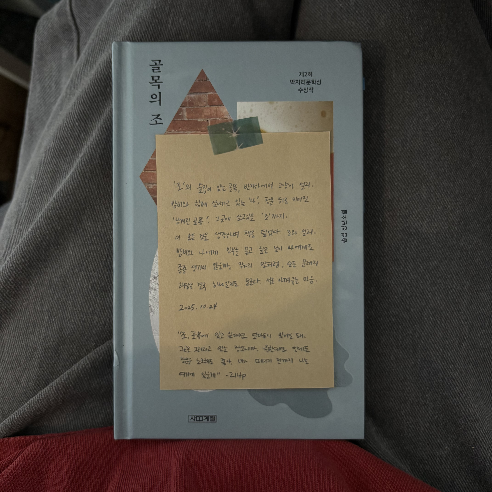

<u>**synopsis, Quotes**</u>  
토요일 아침의 로건 _ 시한부 판정을 받은 '로건', 매주 토요일마다 영어 회화를 가르쳐주던 '젤다'에게 그만 둔다는 말을 하기까지의 일주일이다. 일주일동안 그동안의 사회인으로서의 '나'를 돌아보는 계기를 갖고, 돌아온 토요일 오전, 수업이 끝난 뒤 '젤다'에게 "이제 영어 공부를 그만하려고 해요"라고 말한다. 그때서야 비로소 <u>자신에게 무슨 일이 일어났고 자신이 무엇을 선택했는 지 알게된다</u>
  *"그는 자신에게 무슨 일이 일어났고 자신이 무엇을 선택했는지 알게 되었다. 그러자 비로소 마음이 아팠다"-34p*

밤의 벤치 _ 매일 밤마다 아파트 단지 안을 뛰고, 편의점에서 아이스크림 하나를 사서, 놀이터 옆 등나무 벤치에 앉아 아이스크림을 먹는 '경진'. 또 어떤 날에는 이곳 벤치에 앉아 지나다니는 학습지 교사를 보면서 오래전 경진이 학습지 교사를 사던 시절, 편의점 파라솔 아래나 분식점 창가 자리에 앉아 간단히 밥을 먹고 숨을 돌리던 시절을 다시금 회상하기도 하는데.. 그러던 어느 날 등나무 벤치를 철거하고 그곳에 주차장을 만든다는 공고문을 보게 된다. 
 *"한낮에 번화한 거리를 걸을 때면 아직도 오래전 그 편의점의 파라솔과 분식점의 창가 자리가 떠오르고 거기 앉아 밥을 먹고 숨을 돌리던 자신이 생각났다. 어떤 시기의 자신을 거기에 두고 온 것 같은 기분이 들었다. 결진은 밤의 벤치에도 자신의 일부를 두고 왔고 그것이 영영 사라져버렸음을 깨달았다. 그리고 그것에 대해 누구에게도 말하지 못하리라는 걸 알았다."-64p*

그것으로 충분한 밤 _ '유선'의 집에 남편 '종우'의 친구들이 다녀간 이후 둘은 마주 앉아 남은 연휴를 어떻게 보내면 좋을 지 이야기한다. '유선'은 모임이 있던 좀 전의 시간들을 다시금 생각해보게 되고, 우리 가정에 일어난 사건을 짐작하게 된다. 
 *"선우는 커나가고 부모님의 연로해서 자주 아팠으며 이사 과정은 복잡했다. 많은 밤동안 두 사람은 그런 것들에 대해 얘기했고 하나하나 해결해나갔다. 그리고 이제 그런 밤들은 다 흩어져버렸다. 종우는 시간이 흐른 뒤에도 기억할 만한 밤이 있었으면 좋겠다고 생각했다"-71p*

지나가는 사람 _ 공인중개사 '석주'에게 이혼하고 삶이 완전히 바뀐 동창생 '재경'이 찾아온다. 드라마에 나오는 대저택같은 집에서 자라, 영화 세트장같이 정교하게 꾸며진 신혼집에서 결혼 생활을 하고 정기적으로 친구들을 초대해서 멋진 파티를 열었던 '재경'인데, 지금은 작은 원룸을 찾고 있다고. 석주는 이런 재경의 처지를 안타깝게 보면서도 선뜻 도움의 손길을 내밀지 못하고, 다음을 기약하며 으레 지나가버린다. 그렇게 연락처 한 번 제대로 물어보지 못한 '석주'는 '재경'이 다른 곳으로 이사를 가게 된다는 소식을 듣고서야 *기다리기에는 인생이 그리 길지 않다*는 것을 깨닫게 된다.
 *"이제는 무료함이나 갑갑함과 상관없이, 마음의 상태나 희망의 유무와 무관하게 잠잠히 기다려야 하는 날이 있다는 걸 알게 되었다."-122p*

다른 미래 _ '진'은 비오는 바닷가에서 해수욕을 즐기고 있는 딸과 사위, 손녀를 보면서 '이런 날씨에 바다라니'라며 투정을 잔뜩 부린다. 이십년 전 자동차 사고로 남편을 읽은 '진'이 장래식장에서 돌아와 노트에 적은 **다른 미래**. 다른 사람을 만나 또 다른 출발을 할 수 있었던 기회가 있었음에도 불가능이라는 판단으로 정리했다. 비오는 바다에서 해수욕을 즐기고 있는 딸과 사위, 손녀를 보면서 그동안의 자신을 한 번 돌아보게 되고, 딸에게 핸드폰을 가져다주다가 실수로 바다에 빠지게 되는데.. 그 순간 *얼굴 위로 비가 쏟아지는데 가릴 것도 없고 머리부터 발끝까지 흠뻑 젖으니 시원하고 후련해*하면서 나중의 일들은 생각하지 않기로 마음 먹게 된다.
 *"진은 한 페이지를 비워두고 다름 장에 볼펜으로 날짜와 함께 다른 생활, 다른 미래, 라고 썼다. (...) 떠다니는 감정이나 생각이 아니라 정리된 기록이 필요했다. 희영이 졸업하고 독립할 때까지 같이 살면서 돌봐야 하고 대학 등록금과 생활비도 필요했다"-139p*

기다리는 동안 _ '인희'는 '재영'과 이혼한 지 2년이 다 되었는데, 해결되지 않은 위자료가 있다. 원룸 세입자의 계약이 끝나는 대로 보증금을 돌려받아 남은 위자료를 해결하겠다는 '재영'을 '인희'는 기다려주었지만, '재영'은 나서서 문제를 해결하는 타입이 아니었다. '인희'는 현재 살고있는 오피스텔의 재계약 문제와 다음 학기 강의를 쉬어야 하는 문제로 '재영'에게 위자료를 받아야만 하는 상황이다. 자꾸 전화를 피하는 '재영'을 직접 만나기 위해서 둘이 함께 살았던 집으로 가는 '인희'. 언제 올지도 모르는 그를 기다리는 '인희'의 이야기. 
 *"예전이나 지금이나 산다는 건 오래된 책장 앞에서 서성이는 일 같았다. 칸칸마다 책을 쌓아두어 더는 꽂을 데가 없이 빽빽한데 정작 필요한 책은 찾지 못했다. 분명히 있는 것 같은데, 끙끙거리며 해맬 때는 보이지 않다가 자신의 기억을 신뢰하지 못해 새로 주문하고 나면 슬그머니 나타나는 식이었다."-178p*

밤이 영원할 것처럼 _ 횡단보도를 지나다가 발목을 다친 '동희'는 당분간 목발일 짚고 다녀야 한다. 게다가 다니는 회사에서 고객상담팀 자리를 위해서 '동희'의 본부장 집무실을 비워달라는 대표의 연락을 받게되고 불편한 모음으로 집무실을 정리한다. '동희'는 어서 빨리 새로 주문한 모션 베드에 누워 '심장보다 높이' 다리를 올려놓고 싶다.

   

<u>**Notes**</u>  
'조'의 술집이 있는 골목, 반지하에서 고양이 설리 밤비와 함께 살아가고 있는 '나', 창문 뒤로 이어진 남겨진 골목, 그 곳에 살고 있는 '조'까지. 이 모든 것을 상상하면서 책을 덮었다. 조와 설리, 밤비와 '나'에게 안부를 묻고 싶은 날이 나에게도 종종 생기지 않을까. 작가의 말처럼, 모든 문제의 해답은 결국 하나일지도 모른다. 서로 아껴주는 마음.
   

<u>**Quotes**</u>  

***"무언가 중요한 것이 끝나가는 동시에 시작하는 시기인 듯하다. 모든 문제의 해답은 결국 하나일지도 모른다. 서로 아껴주는 마음."***  - 작가의 말 중에서
