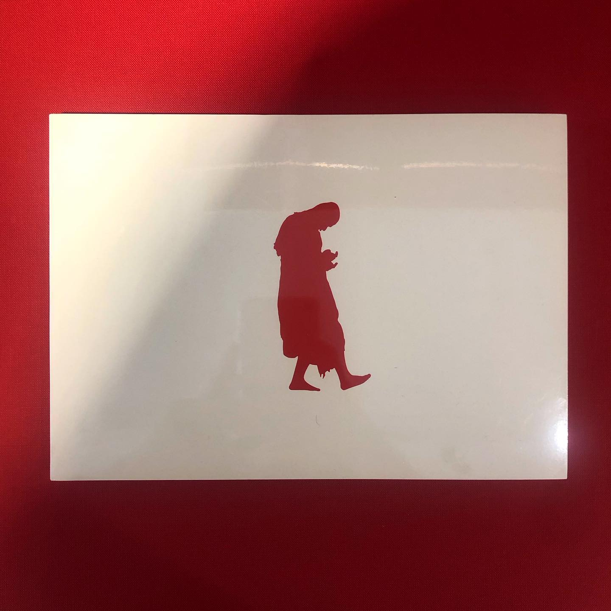
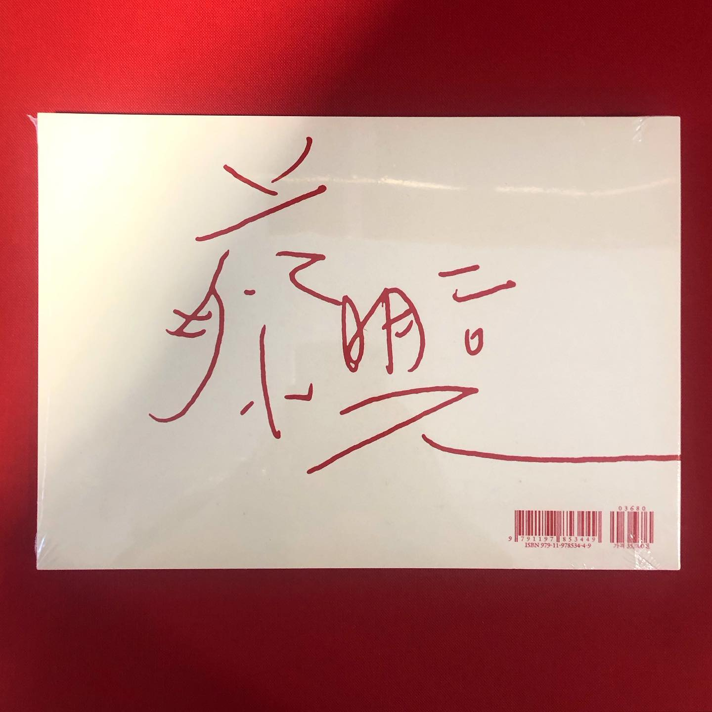
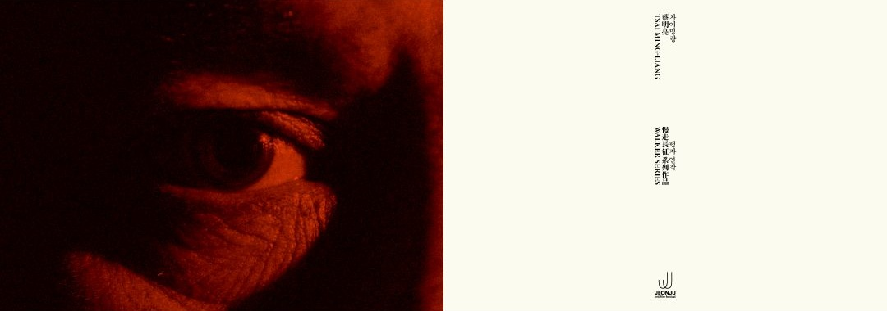
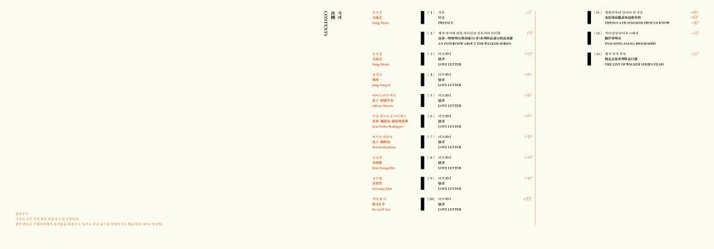
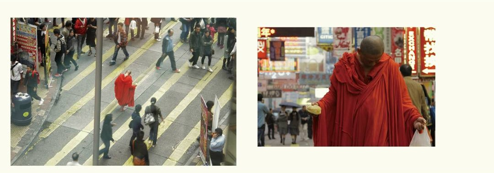
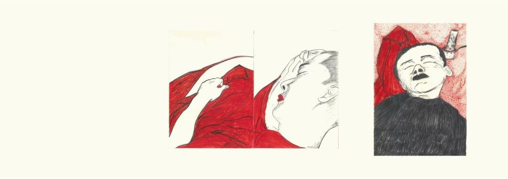
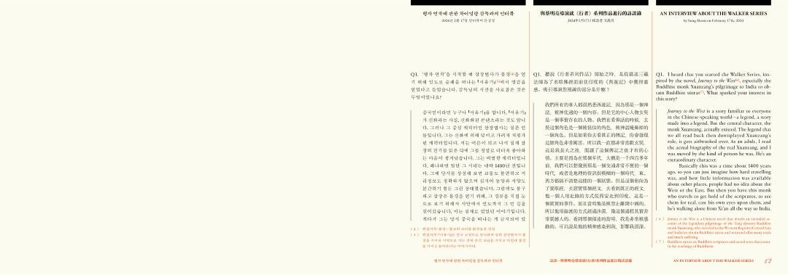
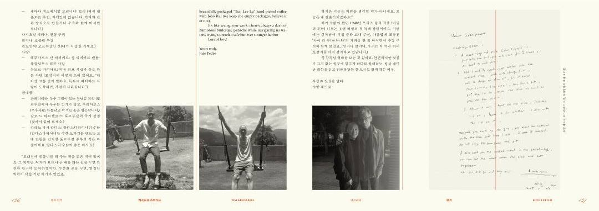
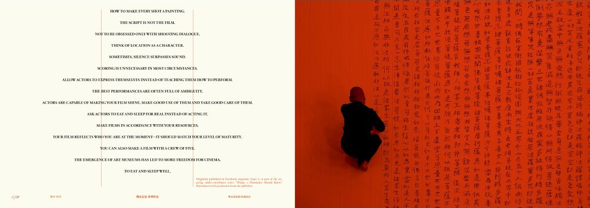

_

<u>**Notes**</u>  
이 책은 2024년 전주국제영화제에서 기획하고 상영했던 차이밍량 감독의 행자 연작을 책으로도 기획 출판한 서적이다. 배우 이강생이 붉은 승복을 입고 맨발로 세계 여러 도시를 아주 느리게 걷는 모습을 담은 일련의 단편 영화 시리즈인 '행자 연작'은, 상업적인 영화 시장에 대한 차이밍량 감독의 비판적 시각과 그만의 독자적인 예술 철학을 보여주는 대표적인 기록물이기도 하다. 파주에 위치한 카페 JIDO에서 읽고, 좋았던 부분을 발췌해서 메모하여 옮겼다.

🎞️ [제25회 전주국제영화제 | 차이밍량 - 행자 연작 소개 영상](https://youtu.be/8lW8EjpziZY?si=feQfJ9ZdOSO0U-lH)
 📖 [제25회 전주국제영화제 | 인터뷰: [차이밍량 행자 연작] 디자인 - 스튜디오 신신](https://jeonjufest.kr/media/magazineView.asp?idx=8674)
   
<u>**Quotes**</u>  
행자 연작은 영화예술의 산업적 변화와 영화사에 의미가 있다. **미학적으로도 아름다운 영화이지만 동시에 벼락같은 깨달음은 주는 영화**기도 하다. 어떤 목적도 없어 보이고, 무언가를 이루는 것 같지도 않고, 세상에 쓸모라고는 없어 보이는, 이 무용한 이강생의 무한 반복되는 느린 움직임을을 보고 있자면....삼장법사가 불경을 통해 전하려고 했던 삶의 진리에 다다른다. 어느것도 멈춰져있지 않다는 것, 삶은 끊임없이 움직이고 지속해서 살아나가는 길밖에 없다는 것. 이강생이 내딛는 한 발짝이란 실은 온몸이 흔들릴 정도로 힘든 일이며, 발을 내딛기 위해서는 온몸과 정신을 순간에 집중해야 한다는 것 말이다. 자신의 인생을 위해 집중하거나 정지해본 적 없는 자본 속의 우리에게 시간을 선물하는 것이다. 우리에게 정말 더 무언가 필요한가. 우리는 무엇을 보고, 느끼며, 살아가고 있는가. 형태가 없다는 <무색 無色>으로 행자의 첫 포문을 연 차이밍량 감독이 머무는 바 없다는 <무소주 無所住>로 열번째 영화를 소개한다. 우리를 사유의 방으로 초대하는 '행자 연작' 특별전을 통해 무엇도 고정된 것은 없고, 모든 것은 변한다는 금강경의 지혜가 관객에게 오롯이 전달되길 바란다. 우리는 그저 삶의 순간을 걸어나갈 뿐이다.

**"모든 현상계는 꿈, 허깨비, 물거품, 그림자, 이슬, 번개 같으니 마땅히 이와 같이 볼지니라" - 금강경**
   

