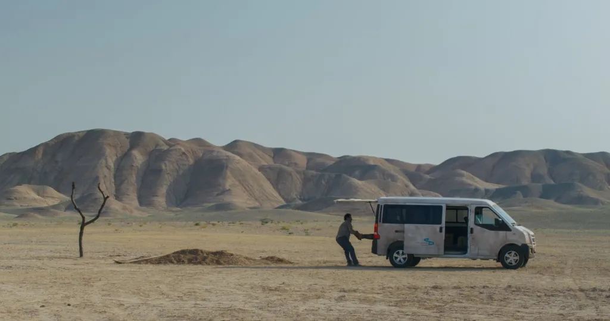

2025 | 드라마 | 감독 자파르 파니히 | 출연 바히드 모바셰리, 마리암 아프샤리
 ★★★★
   

  

**NOTE** 
어느 늦은 밤, 불빛이 하나도 없는 캄캄한 도로에서 들개를 치는 사고를 겪은 한 남자. 사고 이후 차 안에서 나누는 남자-아내-딸의 대화가 이 영화의 프롤로그가 아주 인상적이다. 어른들은 도로에 불빛이 없었고, 그래서 보지 못했고, 그저 사고였을 뿐이라고 하지만, 아이는 그건 일어날 일이 일어난 것도, 신의 뜻도 아니고, 하나님은 아무 상관 없다고 대답한다. 체제에 대한 비판, 복수를 이행하기에 앞서는 윤리적인 질문들, 가해자는 누구인가 하는 의문들. 결국 이 영화는 행동이 아닌 망설임에 관한 이야기가 아니었을까. *폭력을 행할 수 있었던 상황이었지만, 끝내 행하지 못하고, 그로 인해 누구도 구원받지 못하는 결말. 따라서 정의가 좌절되는 게 아닌 정의라는 개념 자체가 작동 불가능해진 상태*이라는 정성일 평론가의 말에 크게 동의한다.  

딸 : 아빠가 죽였어 
남자 : 난 보지도 못했어, 그게 뛰어들었다고 
아내 : 도로에 불빛이 없으니까, 불쌍한 동물들이 차에 치이는 거야, 그저 사고였을 뿐. 일어날 일은 일어나게 돼 있어. 그걸 우리 앞에 보낸 것도 다 신의 뜻이고 
딸 : 개를 죽인 건 아빠잖아, 하나님은 아무 상관 없어. 

 

**Quote**   

  

**Synopsis** 

  
