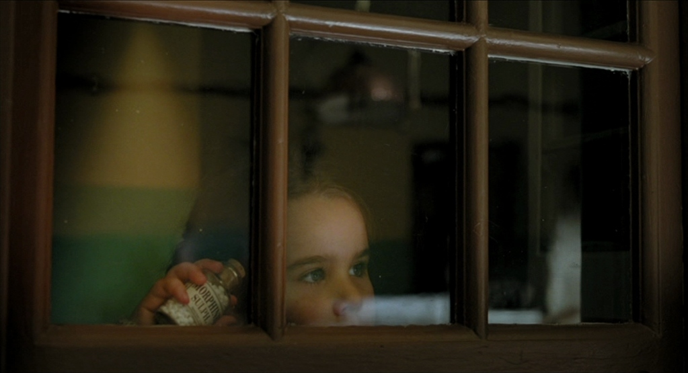
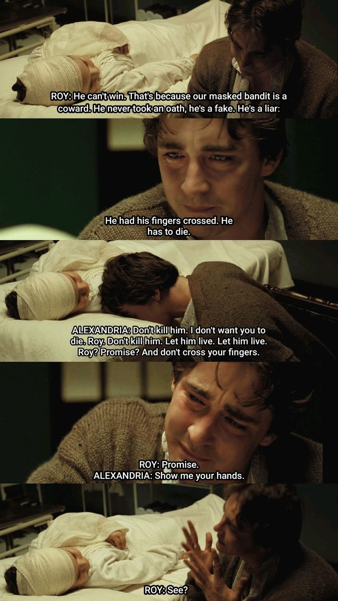

2006 | 드라마 | 감독 타셈 싱 | 출연 리 페이스, 카틴카 언타루
 ★★★★
   

  

**NOTE** 
**"당신에게는 연민의 감정이 있습니까"**   
글을 알지 못하는 어린 아이에게 그림책을 읽어줄 때, 어른은 글을 보고 읽지만 아이는 그림을 보면서 듣는다고 한다. 그래서 둘의 감상이 아주 다를 거라고. 꼭 이 영화가 그랬다. 로이가 들려주는 이야기가 알렉산드리아의 무궁무진한 상상력을 만나 광활하고 풍성함을 넘어 경이롭기에 이르는 화면으로 만들어졌다. 헤엄치는 코끼리들, 산호초로 변하는 이국적인 나비, 파란 집들이 있는 도시, 붉은 공작처럼 깃털 코트를 입은 다윈, 흐르는 듯한 생생한 초록색 옷과 보석으로 치장한 과묵한 인디언, 태양처럼 노란 코트와 빨간 모자를 쓴 루이지 등... 따라서 4년에 걸쳐서 24개국을 돌며 컴퓨터 그래픽 없이 직접 촬영한 환상적인 장면들은 이 영화를 완성하는 데 있어서 반드시 필요했던 선택이었을 것이다.

**“Tell me the next part”** 
이야기를 더 듣고 싶어하던 알렉산드리아의 눈망울과 이야기가 비극으로 끝나지 않게 해달라고 애원하던 그녀의 표정, 그리고 완전히 무너져버린 순간의 로이의 얼굴. 끝내 이 영화가 남기는 건 장황한 로케이션 장면이나 화려했던 이야기 속 인물들이 아니라 현실에서 우리가 마주한 그들의 표정이었다. 

<u>이야기를 만드는</u> 로이와 그 <u>이야기 안에 살아 있는</u> 알렉산드리아의 시선이 겹치는 순간이 있는데, 그 장면이 가장 기억에 남는다. 

 

**Quote**   
로이 : 그는 이길 수 없어. 우리 가면 쓴 도적은 겁쟁이거든. 맹세도 안 했고, 가짜야. 거짓말쟁이라고. 손가락을 교차하고 있었어. 그러면 죽어야 해.   
알렉산드리아 : 죽이지 마. 난 네가 죽는 것도 싫어, 로이. 죽이지 마. 살려줘. 살려줘. 로이? 약속해? 손가락 교차하지 말고.  
로이 : 약속해.   
알렉산드리아 : 손 보여줘.  
로이 : 봤지?    
 

  

 '이건 내 이야기니까' 내 마음대로 하겠다는 로이에게  **"내 이야기이기도 해요"**라고 외치는 알렉산드리아..
