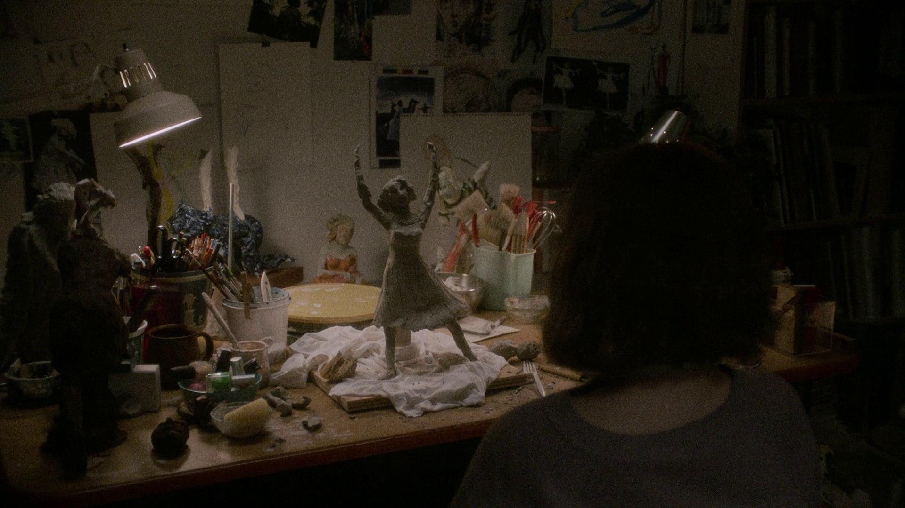
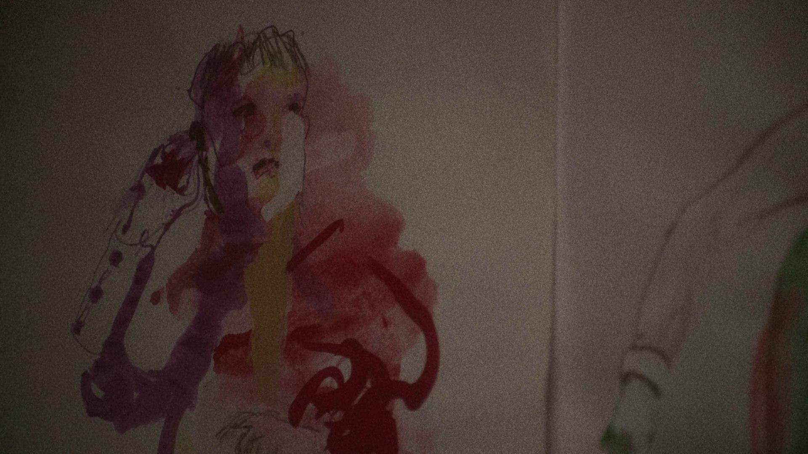
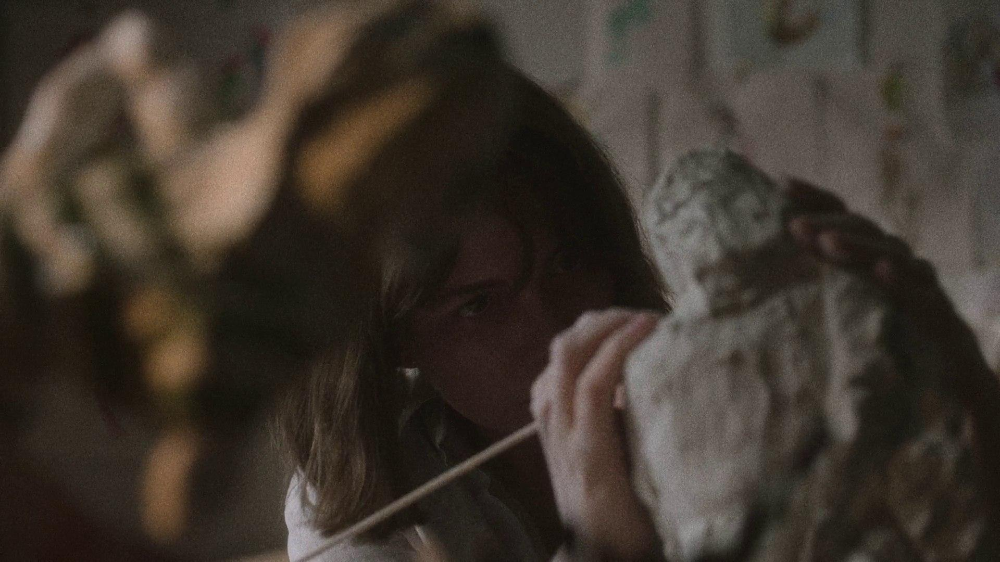
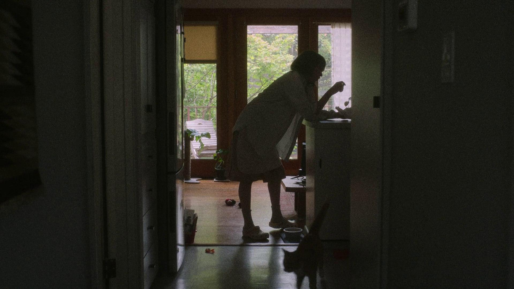
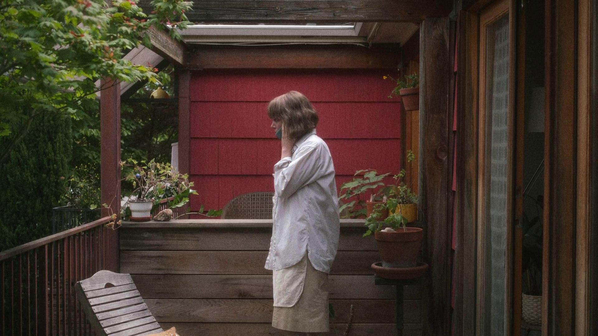
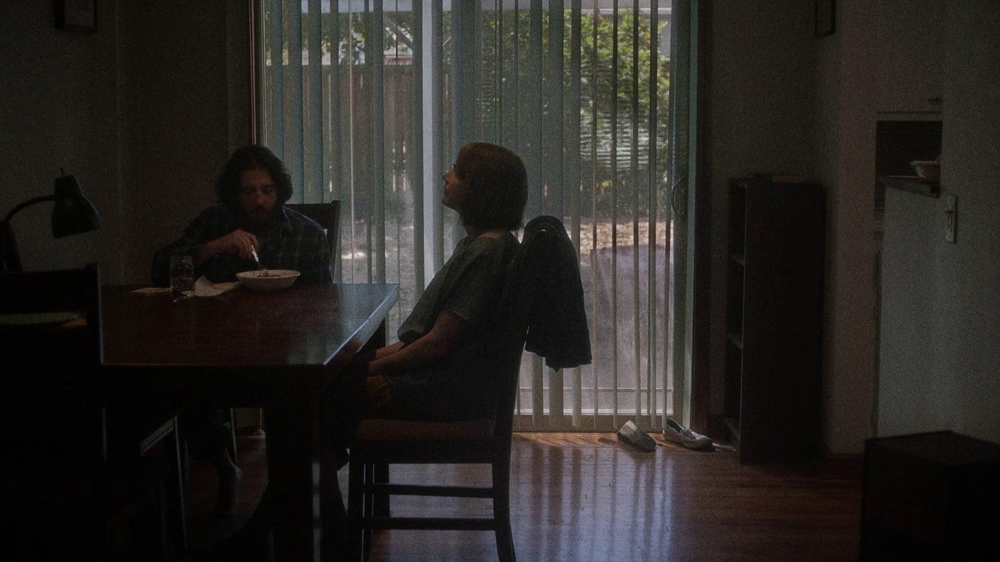
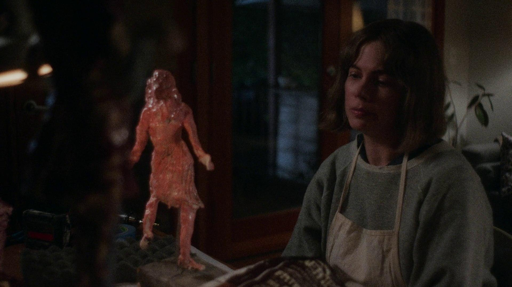
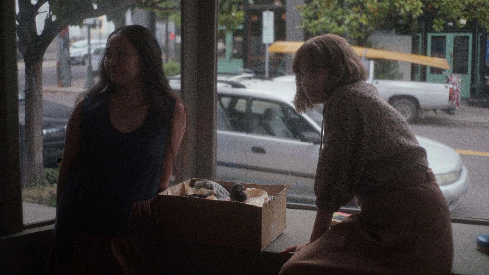
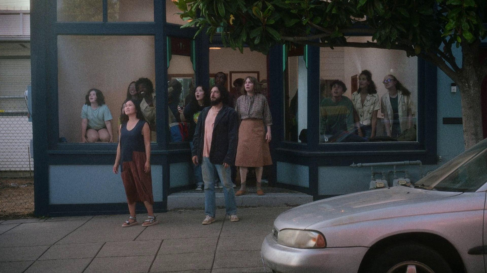
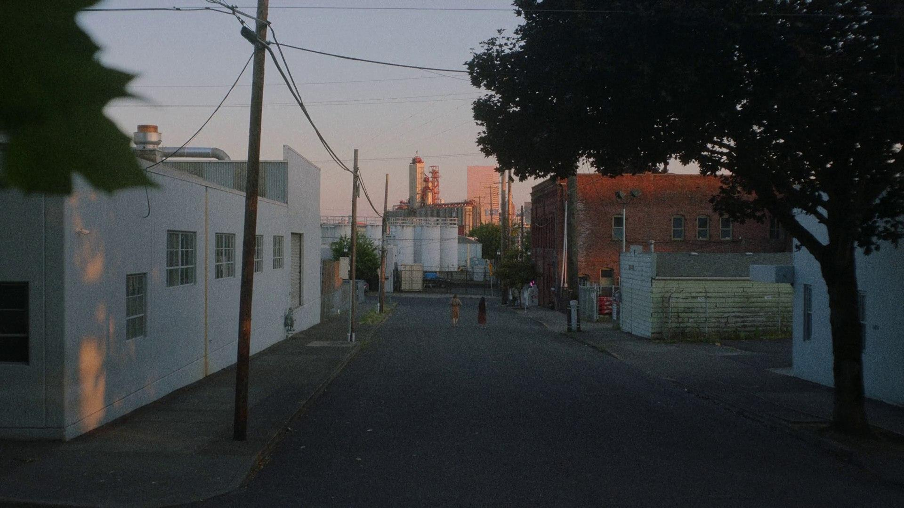

2022 | 드라마 | 감독 켈리 레이카트 | 출연 미셸 윌리엄스, 홍 차우
 ★★★★
   

  

**NOTE** 
리지의 일상을 가만히 들여다보면서, 창작자의 삶을 잠시 체험할 수 있었다. 작업에 몰두하고 싶은 그녀의 마음도, 그 사이 침입되는 수많은 장애물들을 마주할 때 그녀의 복잡한 심정과 분노도 모두 알 것만 같았다. 가마에서 꺼내진 본인의 조각품을 이렇게 저렇게 돌려보면서 "너무 예쁘지 않나요" 라고 말하는 그녀의 표정이 잊혀지지가 않는다. 나도 내가 만든 무엇을 저토록 사랑해본 적이 있었던가, 이런 질문도 해보았고. 

또한 한쪽 면이 새카맣게 그을린 조각품을 보고 크게 실망하지만 이내 받아드리는 리지를 보면서, 이 모든 과정, 즉 작품을 준비하는 동안의 외부적인 개입과 작품이 만들어지는 과정에서의 불가항력적인 요소들까지 이 모두가 작품이라는 것을 알게 되었다. 

 

**Quote**  
영화 <쇼잉업>은 마치 감탄하는 그림 앞에 선 사람처럼 세심하게 작품을 바라봅니다. 하지만 완성된 작품을 보여주는 대신, 작품이 만들어지는 과정을 보여줍니다. 차고 작업실에서 흙을 깎아내는 예술가의 모습을 길고 느린 템포로 담아냅니다. 그녀는 말라붙은 조각상의 팔을 부러뜨리고는 고통에 얼굴을 찡그리며 "미안해"라고 속삭인 후 새 팔을 만듭니다. 영화 상영 시간 동안 그녀가 사과하는 장면은 이때가 유일합니다. - 영화평론가 '사라 웰치 라슨'의 리뷰 중에서
  
(...) 이 모든 여정을 함께 했던 비둘기가 타인들의 손에 의해서 이 이야기의 무대를 벗어나게 되는데, 그게 뭔가 사건이라고 하기엔 작지만 하나의 사건이, 삶의 마디 하나가 끝났다는 듯이 날아가고. 이 영화의 에필로그는 비둘기의 시건으로 바라본 것 같은 앵글로 리지와 조를 지긋이 담아낸다. -김혜리의 필름클럽 <쇼잉업> 에피소드 중에서

  

**Synopsis** 
리지(미셸 윌리엄스)가 자신의 개인전 개막을 앞둔 한 주 동안의 이야기. 전시를 앞두고 창작에 대한 몰두와 집중이 필요한 시기에 그녀에게 여러가지 장애물들이 개입하게 된다. 직장 생활과 고양이 밥 주기, 동생 챙기기, 끊긴 온수로 집주인 조(홍 차우)에게 수리를 요청하기, 다친 비둘기 돌보기 등 일주일 내내 외부로부터 시달리게 되지만 그녀는 공동체의 삶을 유지하기 위해 이 모든 분노를 산더미처럼 쌓아두고 해결해 나가야만 한다.  

  

 
 
 
 
 
 
 
 
 