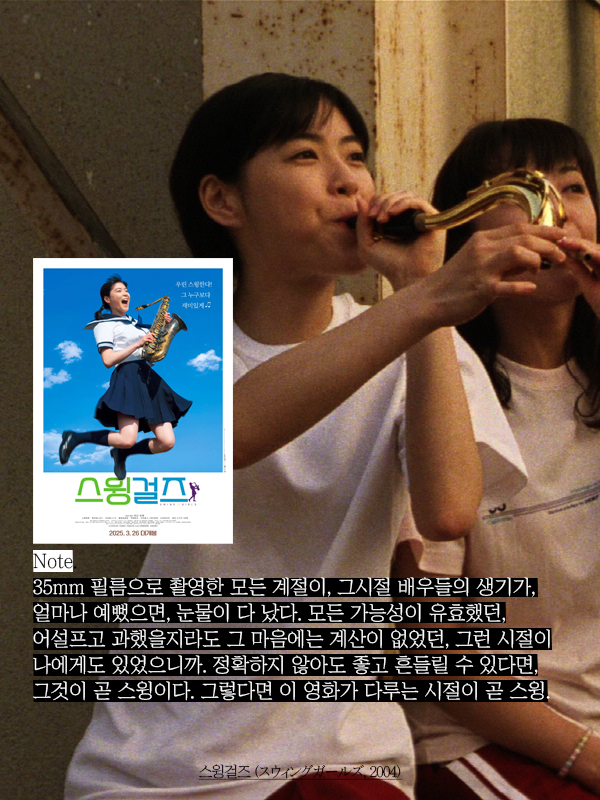

2004 | 코미디 | 감독 야구치 시노부 | 출연 우에노 주리, 히라오카 유타
 ★★★★
   

  

**NOTE** 
35mm 필름으로 촬영한 모든 계절이, 그시절 배우들의 생기가, 얼마나 예뻤으면, 눈물이 다 났다. 모든 가능성이 유효했던, 어설프고 과했을지라도 그 마음에는 계산이 없었던, 그런 시절이 나에게도 있었으니까. 정확하지 않아도 좋고 흔들릴 수 있다면, 그것이 곧 스윙이다. 그렇다면 이 영화가 다루는 시절이 곧 스윙이다.

 

**Quote**  
*아무것도 아니던 이들이 한 가지를 열심히 하게 되는 것. 그저 그 과정을 보여주는 것. 그래서 그의 영화에는 경쟁도 없다. <워터 보이즈>의 소년들도 <스윙걸즈>의 소녀들도 학교 축제나 지역 음악 발표회에 나가는 것뿐, 이긴다 진다의 개념이 없다. 굳이 그들의 승리를 말한다면, 애정을 갖고 뭔가를 처음으로 이루어낸 일, 그것이 그들이 얻게 된 인생의 작은 승리다.*

*이들 주인공의 삶이 활기를 얻게 되는 것은 갑자기 침투한 틈입자 때문이다. 틈입자는 무기력한 삶에 균열을 일으키고, 단단한 소심과 무심의 껍질을 깨뜨린다. 야구치 시노부는 틈입자를 고를 때도 논리적으로 다듬어진 것을 택하지 않는다. **“영화에서 보면 재즈도 그렇고 수중발레도 그렇고 아이들이 찾으려고 찾은 게 아니다. 그냥 나타나서 ‘뭐야? 뭐야?’ 하고 시작하게 되는 거다. 얼떨결에 끌려갔다가 점점 즐기게 되는 그 과정이 재밌지 않은가.”** -씨네21 김나형 기자 [야구치 시노부를 만나다] 중에서*

  

**Synopsis** 
여름방학, 보충 수업 중인 토모코(우에노주리)는 함께 수업을 듣는 친구들과 함께 배달되지 못한 합주부 도시락을 전달하러 간다. 이동 중에 상해버린 도시락을 먹고 합주부 전원이 식중독에 걸리게 되는데.. 그 공백을 도시락을 배달했던 토모코와 보충반 친구들이 대신하기로 한다. 이후 식중독에 걸렸던 합주부들이 회복 후 다시 돌아오게 되고, 그사이 재즈에 흥미를 느끼게 된 토모코와 친구들은 자신들만의 재즈 밴드 '스윙걸즈'를 만든다. 악기 살 돈을 모으기 위해 고군분투하며 여러 소동을 겪고 어렵게 중고 악기를 구매한 후 연습을 이어가지만, 진전이 없다. 이때 수학선생님 타다히코의 '스윙을 연주하라'는 조언을 듣고 나아가야할 방향을 잡은 스윙걸즈는 이내 실력을 갖춘 밴드부로 성장하게 된다. 그해 겨울, 스윙걸즈는 타다히코 선생님의 도움을 받아 시내에서 열리는 청소년 음악회에 참가하게 된다. 

