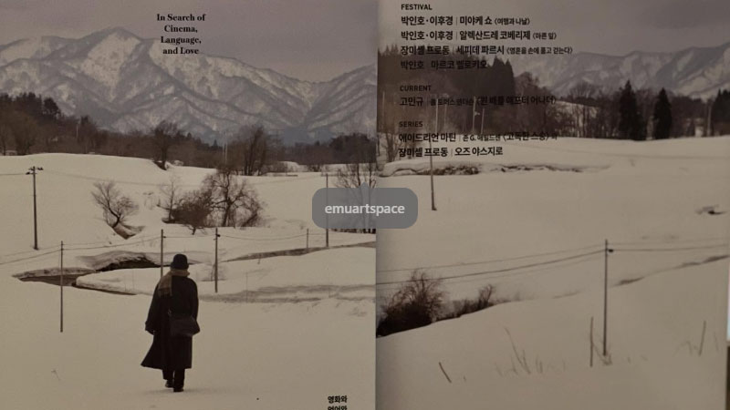

2025 | 드라마 | 감독 미야케 쇼 | 출연 심은경, 카와이 유미
   

  

**NOTE** 
여름에는 상처가, 겨울에는 구멍이, 이야기를 만든다. 무엇이 사람들을 행복하게 하는지 모르겠다는 고백과 함께. 스크린을 보고 있는 것만으로도 여름-겨울을 지나는 여행을 하는 기분이었다. 4:3 비율의 프레임 안에 계절과 날씨, 그날의 온도까지도 이토록 우아하고 유려하게 담을 수 있다니. 연신 감탄하면서 보았다. 카메라 하나 둘러메고 어디로든 떠나고 싶어졌다. 말로부터 멀어지고 싶어졌다.

 

**Quote**  
*거친 파도 소리아 눈의 고요함 사이에서 불안함과 우스꽝스러움 사이에서 하나의 '여행'이 서서히 형태를 바꿔갑니다. 극장에서 낯선 이가 되는 특별한 경험을 마음껏 즐겨주세요 - 미야케 쇼*

*그리하여 이 영화는 카메라의 여행이기도 하다. 이의 작업을 독려했던 은사의 죽음은 그와 똑같이 생긴 쌍둥이 동생에 의해 비통함 대신 신기함으로 뒤바뀌고, 그는 이미지 앞에서의 자격을 의심하는 이의 만류를 무릅쓰고 기어이 오래된 필름 카메라를 쥐어준다. 집 안 선반에 잠들었던 카메라가 이와 함께 낯선 소도시에 도착해 종내에는 이조차 구경하지 못했던- 벤조가 그리워하는- 누군가의 집 안까지 들어가는 셈이다. 필름카메라는 언어 바깥으로 솟아오르는 숏과 몽타주의 생명력을 품어내는 사물로서 <여행과 나날>에서 잠시 주인을 떠났다가 돌아온다. 카메라야말로 누구보다도 멀리 여행하는 존재이다. <u>어느 작가의 작은 회복기를 통과하며 우리는 그가 믿는 매체가 세계를 모험하는 방식을 함께 경험했다. 그 끝에, 기차역으로 향하는 주인공이 미지의 설원 위를 걸어 나간다. 여행과 나날의 또다른 시작이다.</u> -씨네21, 김소미 기자*