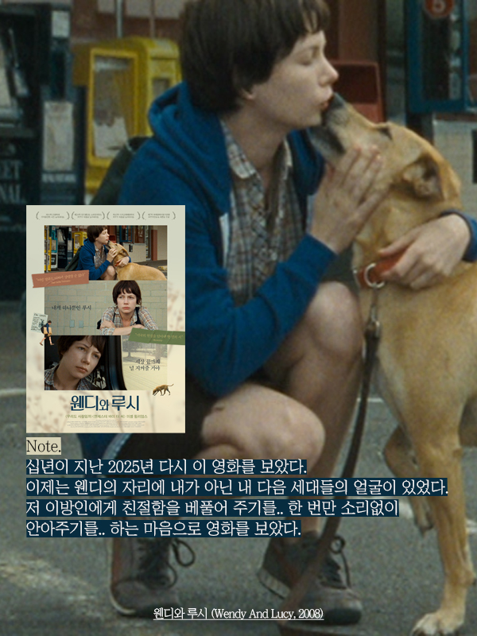
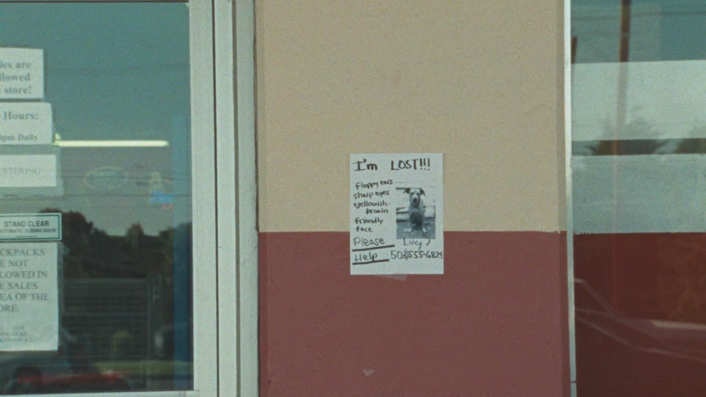

2008 | 드라마 | 감독 켈리 레이카트 | 촬영 | 샘 레비 | 출연 미셸 윌리엄스, 루시
 ★★★★
   

  

**NOTE** 
스물 다섯, 이 영화를 처음 보았다. 그때의 나는 취업을 목적으로 부산을 떠나 서울로 독립한 상태였고, 아르바이트로 버는 한 달 수입은 생활하는 데 턱없이 모자라 근무지에서 나눠주는 빵과 우유로 하루를 버티는 날이 많았다. 그러한 상황에서, 노숙과 굶주림으로 추락하는 걸 무력하게 지켜볼 수 밖에 없는 <웬디와 루시>를 보았으니 생각만으로도 가슴 한 편이 저릴 수 밖에. 십년이 지난 2025년 다시 이 영화를 보았다. 이제는 웬디의 자리에 내가 아닌 내 다음 세대들의 얼굴이 있었다. 저 이방인에게 친절함을 베풀어 주기를.. 한 번만 소리없이 안아주기를.. 하는 마음으로 영화를 다 보았다.  
 

**Quote**  
Q : 켈리, 이 프로젝트가 어떻게 시작되었는지, 이야기의 씨앗이 어떻게 생겨났는지 말씀해 주실 수 있을까요?

Kelly : *"이야기의 출발점은 사실 허리케인 카트리나 직후였어요.
사람들이 왜 애초에 자신의 삶을 그렇게까지 위태로운 상태로 내몰게 되는지에 대해 이야기하는 걸 계속 듣게 됐죠. 그리고 그때 미국 사회 전반에 흐르던 분위기가 있었어요. 가난이라는 것이 더 이상 무시하고 지나칠 수 있는 문제가 아니라는 감각이요. 그 가난을 향한 일종의 경멸 같은 것도 분명히 존재했고요. 그래서 존(레이먼드)과 저는 이런 질문을 하게 됐어요. <u>만약 중산층에 발을 걸칠 틈조차 없다면, 심지어 그걸 목표로 삼아 애쓰는 단계에도 이르지 못했다면, 도대체 어떻게 삶을 조금이라도 나아지게 할 수 있을까? 안전망도 없고, 지지해줄 사람도 없고, 신탁기금도 없고, 좋은 교육을 받은 적도 없다면, 그런데도 그럴 의지와 기운은 있다면, 그런 사람은 어떻게 다음 단계로 나아갈 수 있을까? 도대체 그게 가능한 일일까? "</u> - 2008년, 뉴욕 링컨 센터 인터뷰 중에서*
  

**Synopsis** 
웬디(미셸 윌리엄스)는 일자리를 구하기 위해서 반려견 루시와 함께 알래스카로 향하고 있다. 이동하는 도중 자동차 고장으로 오리건주의 한 마을에 발이 묶이게 되고, 루시의 사료도 사야하고 자동차도 고쳐야 하는 시점에서 점점 줄어드는 돈이 걱정이다. 식료품 가게에 들어가 물건을 훔쳐 나오다가 직원에게 붙잡힌 웬디는 반나절정도 경찰서에 머무르게 되고, 그 사이 루시가 사라진다. 사방 팔방 찾아보아도, 동물 보호소에도 없는 루시. 절망적인 며칠이 지나고, 동물보호소로부터 루시가 어느 가정에서 임시보호중이라는 연락을 받게 된다. 기쁜 마음도 잠시, 자동차가 더이상 굴러갈 수 없다는 말을 듣고 다시 무너지는 웬디. 그녀는 루시가 있는 곳으로 가지만, 알래스카로 가는 기차에 혼자 오르게 된다. 

  

 
