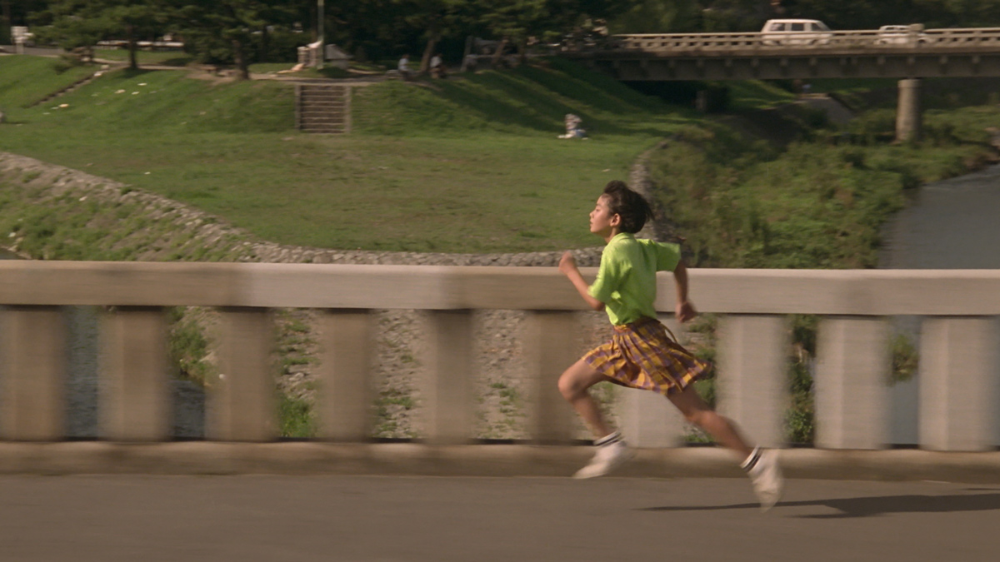
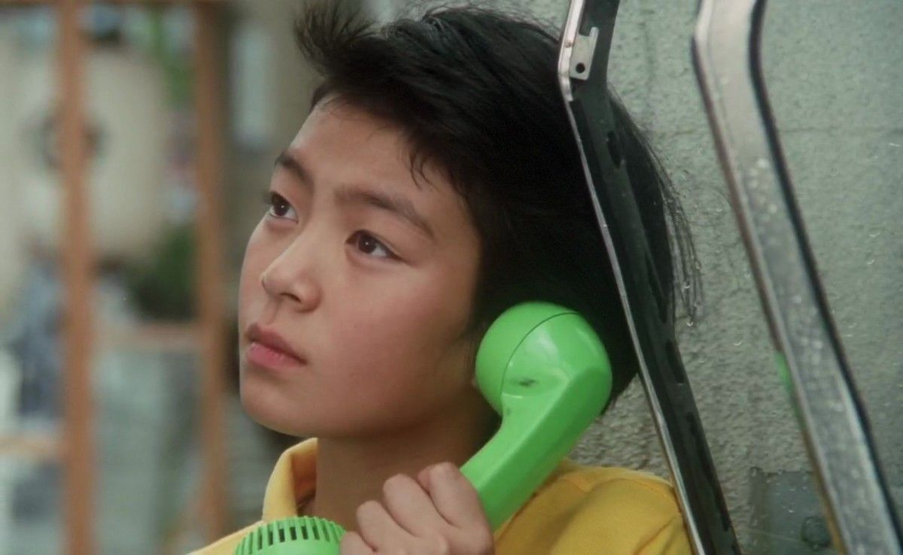

1993 | 드라마 | 감독 소마이 신지 | 출연 타바타 토모코, 사쿠라다 준코
 ★★★★
   

  

**NOTE** 
나에게는 얼마전 가족의 해체를 겪은 9살 여자 조카가 있다. 그 친구가 우리집에 놀러와서 하룻밤 자고 간 날이 있었다. 복층 침실에서 잠들었을 그 아이를 확인하러 올라가 보았더니 입을 꾹 다물고 눈물을 흘리고 있었다. 볼이 틀까봐 걱정되어 닦아 주고 닦아주어도 멈추지 않았던, 작은 흐느낌조차 조심스러워하던, 아이의 울음 그리고 "고모, 저도 가족이 갖고싶어요".. 그날밤 나를 포함한 어른들은 식탁 테이블에 둘러 앉아 아이를 걱정했다. "아직은 너무 어려서 잘 모를거야, 한두해가 지나면 아이는 자랄 거고, 스스로의 힘으로 현명하게 받아드리고 이겨낼거야. 씩씩하게 클거야, 걱정마.." 

소마이신지 감독의 <이사>를 리뷰하려고 준비하는 내내 그날 밤이 생각났다. 어른들의 문제 속에 놓여진 아이가 겪는 혼란을 내가 감히 이해할 수는 없지만, 영화를 통해 렌의 분노, 관찰, 성찰의 순간을 단절 없이 경험해봄으로써, 아이의 회복 탄력성의 힘을 믿어본다. <u>어른처럼 문제를 해결하지 않아도, 설명받지 않아도, 울고 멈추고 돌아서면서 자기 속도로 다시 균형을 찾는 것.</u> 엔딩크래딧의 마지막 장면ㅡ중학교 교복을 입은 렌이 씩씩하게 화면 중앙으로 걸어온다ㅡ을 보면서 작게 기도해본다.

 

**Quote**  
아빠 : 짧은 줄로 셋이 줄넘기 하려니 조금 지쳤어. 
렌 : 다른 사람 줄을 이어서 길게 만들면 되잖아 
아빠 : 그렇게 간단한 게 아니야 
  

**Synopsis** 
어느 가족의 저녁식사 장면으로 영화는 시작한다. 어딘가 불편한 어른들과 그 사이에 6학년 소녀 렌(타바타 토모코)가 있다. 그리고 다음날, 아빠는 다른 곳으로 이사를 간다. 렌은 그것이 부모님의 이혼이라는 사실을 알게 되지만, 받아드리기를 거부한다. 렌은 여전히 세 명이 함께하는 가정을 꿈꾼다. 소마이신지 감독은 특유의 롱테이크 연출로 가족의 해체 이후 아이가 겪는 혼란을 차분하고 잔잔하게, 때로는 열렬하게 보여준다. 

  

 
 
 