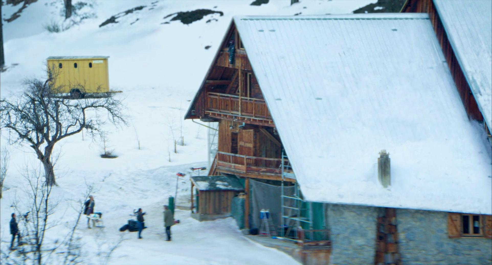
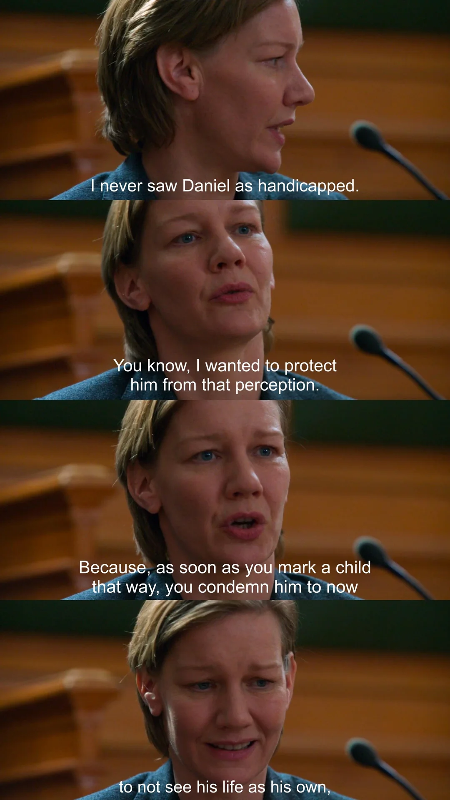
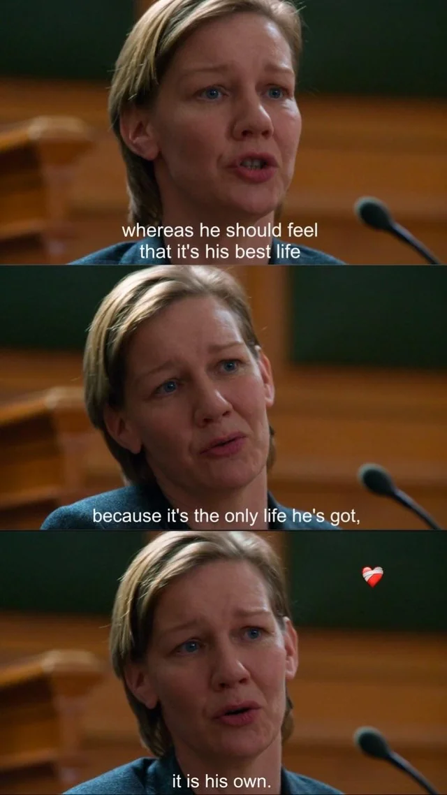

2024 | 드라마 | 감독 쥐스틴 트리에 | 출연 산드라 휠러, 밀로 마차도 그라너
 ★★★★
   

  

**NOTE** 
과연 그녀가 남편을 죽인걸까. 나 역시 여기에 대한 명쾌한 답을 내릴 수가 없었다. 이 영화는 관객인 나를 배심원의 자리에 서게 만들었다. 그저 심증만으로 한 사람을 지목하고 있다는 사실이 스스로도 굉장히 불편하기도 했다. 그러다가 아들 다니엘이 감찰요원 마르쥬와 나누는 대화가 이 영화를 이해하는 데 큰 힌트가 되었다. 

M : 사실은, 어떤 일을 판단하는 데 필요한 요소가 부족하고 그 결핍이 견딜 수 없을 만큼 클 때 우리가 할 수 있는 건 하나뿐이야. 결정하는 거야. 의심을 넘어서기  위해서는 때로는 어느 한쪽을 선택해야 해. 믿어야 할 필요가 있는데 선택지가 두 개라면, 너는 선택해야 해  
D : 그럼… 믿음을 만들어내야 한다는 거예요? 
M : 응.. 어떤 의미에서는. 
D : 그럼 저는 아직 확신이 없는데, 확신 있는 척하라는 거예요? 
M : **아니. 아니야. 결정하라는 거야. 그건 달라.**

 
 

**Synopsis** 
산드라(산드라 휠러)의 아들 다니엘은 강아지와 산책을 다녀오던 길에 산장 다락방에서 떨어져 죽은 사무엘의 시신을 발견하게 된다. 자살인지 타살인지 알 수 없는 상황에서 피해자의 것으로 확인되는 USB메모리가 발견되는데, 그 안에는 부부 싸움의 증거가 담겨있다. 질투와 실망, 직업적인 경쟁이 얽혀있는 다툼, 그리고 양성애자 산드라의 외도.. 수사망은 점점 배우자인 산드라를 향해가고, 산드라는 본인의 모국어가 아닌 영어로 자신을 변호해야만 한다. 그리고 이 사건의 중요한 증인이자 그 이상의 존재인 아들 다니엘, 그의 증언이 이어진다. 그는 말하는 증언은 사실일까. 우리는 무엇을 믿어야 하며, 그 믿음은 무엇에 근거하는걸까.

  

**Quote**  
“나는 다니엘을 장애가 있는 아이로 본 적이 없어요.
알다시피, 나는 그를 그런 인식으로부터 보호하고 싶었어요.
왜냐하면 아이에게 그런 꼬리표를 붙이는 순간,
우리는 그가 이제부터 자신의 삶을 자기 것이라고 보지 못하도록
단죄하게 되니까요.
그는 자신의 삶이 최선의 삶이라고 느껴야 해요.
그게 그가 가진 유일한 삶이니까요.
그리고 그 삶은, 그의 것입니다.”
 

 
 
