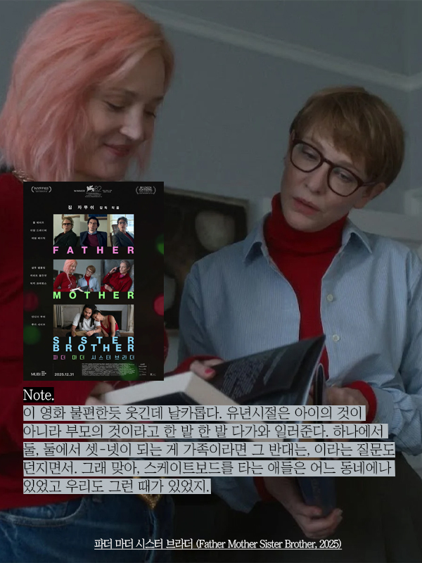

2025 | 드라마 | 감독 짐 자무쉬 | 출연 케이트 블란쳇, 애덤 드라이버
 ★★★★
   

  

**NOTE**  
이 영화 불편한 듯 웃기고, 되게 날카롭다.  

첫번째 에피소드에서 아버지는 자식들을 집으로 초대한다. 일부러 누추하게 연출하고, 내어줄 거라고는 수돗물 밖에 없다고 공표하듯이 짠-하고 건배한다. 왠지 이 아버지, 자식들이 부지불식간에 들이닥치면 어쩌지 하는 마음에 섣부르게 집으로 초대한 눈치다. 첫번째 에피소드는 곱씹을수록 웃기다.

두번째 에피소드에서 엄마는 같이 살고 있지 않은 딸들이지만, 눈만 봐도 다 안다는 눈치다. 각자가 제 역할을 해내느라 애쓰고 애먹고 하는 모습들이 어딘가 쓸쓸했다. 딸 가진 엄마가 되어서 그런가, 늙은 엄마가 자꾸 신경쓰이는 건 왜일까. 헤어지는 순간이 가장 편안해 보이던 두 딸이 괜히 미워지기도 했다.

세번째 에피소드는 이 영화 전체를 차분히 다시 생각하게 만들었다. 유년시절은 아이의 것이 아니라 부모의 것이구나. 하나에서 둘, 둘에서 셋-넷이 되는 것이 가족이라면 그 반대는.. 질문해 보았다. 부모님댁에 갈 때마다 펼쳐보는 사진첩에는 가족이 한 데 모여 살던 시절의 이야기만 모여있구나, 부모가 자식에게 남겨주는 최고의 것은 형제 자매라는 건가, 하는 생각도 들었다. 

 

**Quote**   
<파더 마더 시스터 브라더>는 가족 생활의 **진부한 어색함을 그럼에도 계속 지속되는 유대감에 대한 달콤씁쓸한 명상으로 바꾸어버리는**, 아주 섬세하게 잊혀지지 않으며, **삐딱하게 우습고**, 시각적으로 균형이 잡힌 3부작이다. - 로튼 토마토 평론가 총평