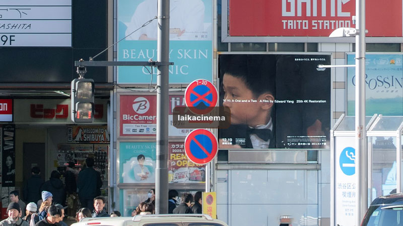
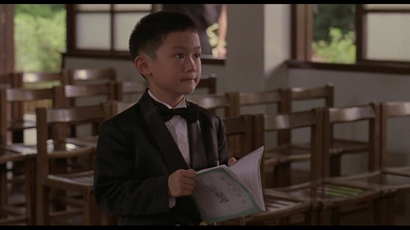

2000 | 드라마 | 감독 에드워드 양 | 출연 조나단 창, 오념진, 켈리 리, 금연령
   

  

**NOTE** 
가장 좋아하는 영화가 무엇이냐는 질문은 언제나 당혹스럽기 마련이다. 기준에 따라 조금씩 달라지기도 하고, 개인적으로는 참 좋아하는 영화임에도 불구하고 추천의 영역에서는 다소 거리가 먼 것만 같고.. 여러가지 이유로 얼버무리다가 최근 재미있게 본 영화를 언급하는 경우가 보통이다. 그럼에도 꼭 하나를 꼽으라면, 에드워드 양 감독의 <하나 그리고 둘>을 얘기한다. '좋은 영화에 국적이 크게 중요한 것 같지는 않으나, 언제나 마음을 움직이게 하는 건 동양의 영화들인 거 같아요' 라는 소감을 덧붙이면서. 그러나 <하나 그리고 둘>이 왜 가장 좋은지, 어쩌다가 나의 최애가 되었는지 설명하기란 너무 어려웠다. 그냥 좋은 것을..

그리고 십 년만에 극장에서 다시 본 <하나 그리고 둘>

NJ, 밍밍, 팅팅, 양양. 평범한 한 가족이지만, 가족 구성원 각각이 저마다의 이야기를 품고 있다. 사십대 NJ가 가장으로서 겪는 위기부터 중년 여성 밍밍이 감당해야 하는 삶의 권태, 사춘기 소녀 팅팅이 겪는 관계 지향적인 방황, 이제 막 세상을 이해하기 시작한 여덟살 소년 양양의 탐구까지. 서로 영향을 주고 받지 않는, 지극히 개인적인 어려움에 직면한 이들이 인고의 시간을 지혜롭게 헤쳐 나가는 과정을, 가만히 지켜보다 보면, 영화를 통해 삶을 세 배로 살고 있다는 대사가 퍽- 와닿는다. 감독의 시선이 참으로 섬세하고도 애틋하여라.

"세상은 우리 생각과 다른 걸까요?"  
"우리는 반쪽자리 진실만 볼 수 있나요?" 

자신의 뒷모습조차 모른 채 살아가는 생의 불완전함을 이토록 아름답게 설명하는 영화가 또 있었던가. 양양이 좋아하는 여자친구를 이해하기 위해 세면대에 물을 받아 잠수 연습을 할 때, 카메라로 모기를 쫓아 셔터를 누를 때, 수업시간에 불현듯 뛰어 나가 사진관으로 향할 때 .. 사실 이런 장면들을 마주하는 순간 도대체 이 영화를 사랑하지 않을 도리가 있을까.

 

**Quote**   
"할머니 죄송해요. 할머니와 말하기 싫었던 게 아니에요. 무슨 말을 할까 곰곰히 생각해 봤는데 할머니가 이미 알고 계실 것 같았어요. 할머니는 항상 남들 말에 귀 기울이라고 하셨잖아요. 사람들은 할머니가 멀리 가셨다고 해요. 그런데 저한테는 간다고 안 하셨잖아요. 그래서 제 생각엔 제가 스스로 알아내야 할 것 같은데.. 할머니, 저는 아직 어리잖아요. 제가 나중에 커서 뭘하고 싶은지 아세요? 사람들에게 알려 주고 싶어요. 그들이 모르는 걸 알려 주고 볼 수 없는 걸 보여 주고 싶어요. 그럼 정말 즐거울 것 같아요. 언젠가 시간이 흘러 할머니가 가신 곳을 알아낼지도 몰라요. 그럼 그곳이 어딘지 사람들한테 말하고 다 같이 할머니를 보러 가도 돼요? 할머니 보고 싶어요. 특히 올해 태어나 아직 이름도 없는 어린 사촌을 볼 때 더욱 그래요. 그 아기를 보면 할머니가 "이젠 늙었나 보다" 하시던 게 생각나요. 저도 사촌에게 말해 주고 싶어요. "나도 다 컸나 보다"라고요." 

