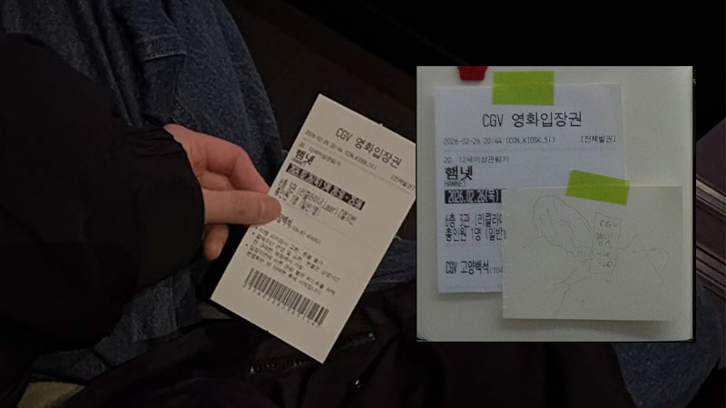

   

  

**햄넷** Hamnet ⨾   
'가슴이 미어져서 두 번은 못 보겠어..' 영화를 보자마자 가장 먼저 든 생각이었다. 고통스러울 정도로 날 것 그대로의 감정들이 엄마인 나를 휩쓸고 지나간 뒤였다. 생사를 오가는 쌍둥이 남매 주디스에게 자리를 바꿔 죽음의 신을 속이자고 제안하는 햄넷을 오래 생각했다. 

제시 버클리의 연기는 대자연 속 우리 모두의 어머니처럼 강인했고 단단했다. 그녀가 가지고 있는ㅡ혹은 품고 있는 에너지가 단순히 그녀가 맡은 역할 때문만은 아닌 것 같았다. 낮고 안정된 목소리와 비대칭으로 움직이는 입꼬리가 그녀를 더 자세히 바라보게 만들었다. 클로이 자오 감독이 말하길, 이 영화는 '여성적'인 영화라고 한다. 여기서 말하는 여성성은 성별의 문제가 아니라 에너지의 차원으로, 보다 자연적인 것에 가깝다고. 그런 의미에서 제시 버클리는 이 작품과 더없이 잘 어울린다는 생각이 들었다.

연극 햄릿에서 햄릿의 아버지 유령 역을 맡은 윌리엄(폴 메스칼)이 연기를 마치고 무대 뒤로 돌아가던 길에 아그네스(제시 버클리)와 눈이 마주치는 장면이 있다. 감정적인 호소가 짙은 영화라 마음이 힘들기는 했지만 눈물을 흘리지는 않았는데, 그 장면에서 폴 메스칼의 얼굴을 보는 순간 갑자기 무엇인가 북받쳐 울음이 터져 나왔다. 

애도란 무엇인가. 죽음이란 무엇인가. 그 불가피함으로부터 우리가 얻을 수 있는 삶의 의미란 무엇일까.

해외의 평론을 보다가 좋은 리뷰를 찾았다. "클로이 자오 감독의 손에서 셰익스피어의 이 불멸의 대사 '죽느냐 사느냐'는 자살에 대한 고찰이라기보다는 ‘존재한다’는 것의 의미, 즉 **죽음의 불가피성 때문에 자기 방어적인 무기력에 빠지기 쉬운 상황에서 삶을 온전히 받아들이는 것에 대한 의미**를 지닙니다. <u>궁극적으로 감독은 세상 사람들에게 새로운 방식으로 상실을 느끼도록 초대하고, 놓아줌으로써 우리 모두의 근본적인 무언가를 해방시킵니다.</u>"