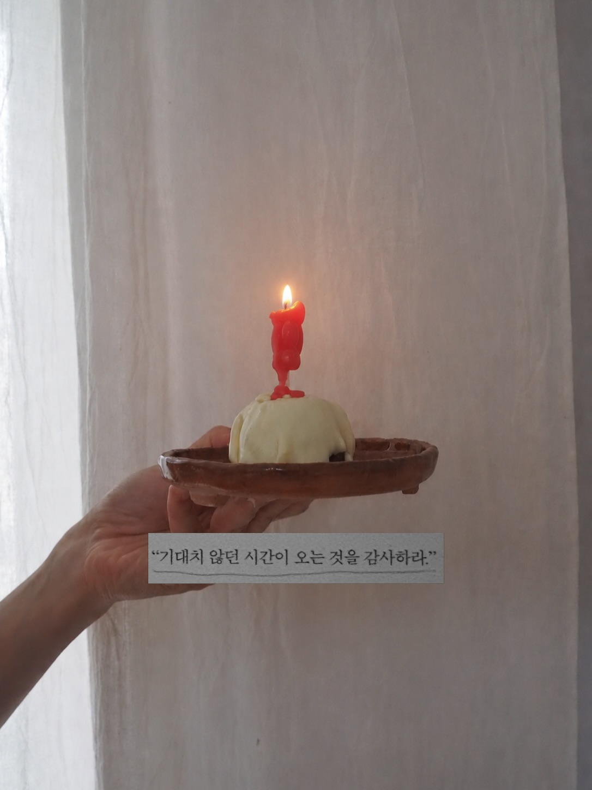
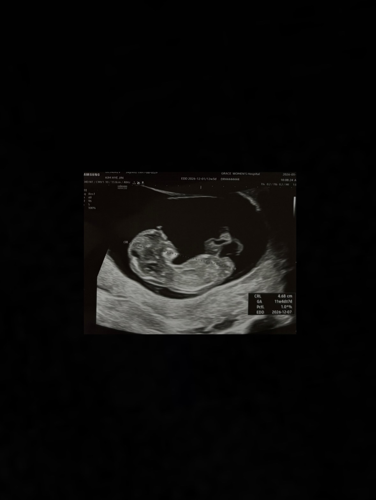

세 번째 친구가 찾아왔다. 몸이 힘든 시간이 꽤나 길었음에도 불구하고 그게 임신 때문인 줄도 모르고 지내다가 12주가 다 되어서야 뱃속에서 아이가 자라고 있다는 걸 알게 되었다. 저 잘 지내고 있었어요, 라고 말하는 것처럼 활발한 움직임으로 나에게 첫인사를 건내준 기특한 친구. 그래서 태명은 기특이라고 지어줬다.

나의 삼십대는 이렇게 지나갈 건 가보다, 하고 마음을 먹으니 어딘가 편안해지는 것도 있다. 기주 혜진 결 시와 넷이 힘을 합쳐 막둥이를 키울 생각을 하니 또 너무 재미있고 신난다.

두 번이나 겪었다고 해서 임신과 출산, 신생아 육아가 쉬워지는 건 아니니까. 또다시 몸이 커졌다가 작아져야 한다는 생각은 그자체로도 너무 슬픈 일이고.. 그럼에도 나를 가장 아끼는 마음으로, 좋아하는 걸 좋아하는 예쁜 마을 지키면서, 그렇게 또 하나의 생명을 품어보자.

반가워 기특!

  