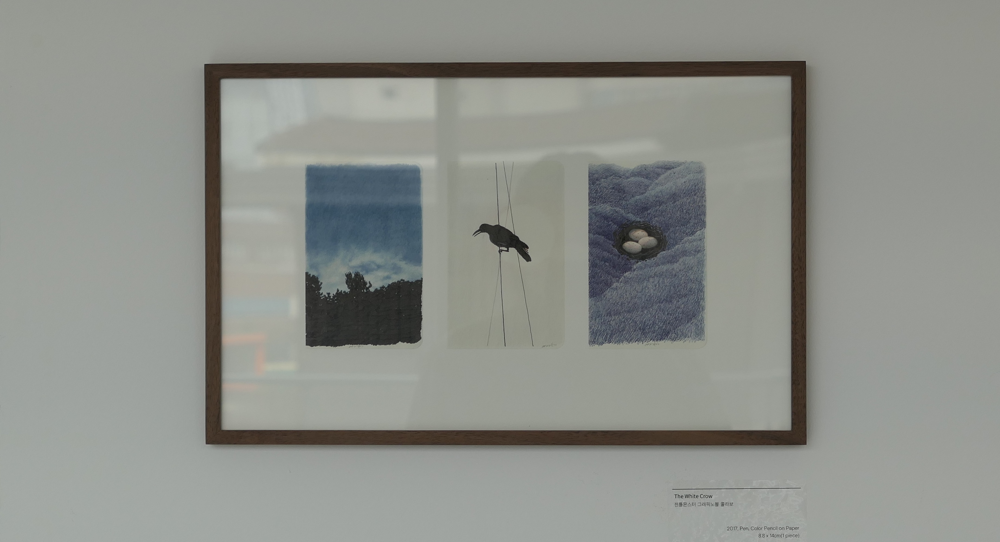
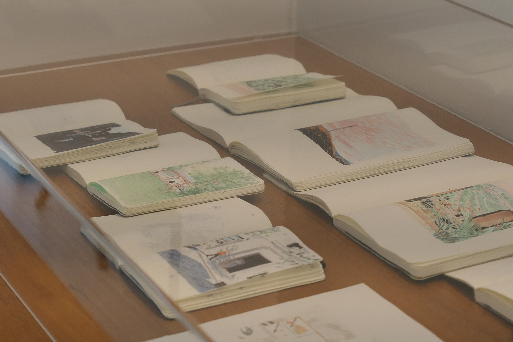

아이에게 책을 읽어줄 때, 엄마는 글에 집중하느라 그림을 잘 살피지 못하지만, 아이는 그림 속에서 숨은 재미를 찾아낸다고 한다. 일러스트레이터이면서 동시에 애니메이션 감독이기도 한 이규태 작가의 전시를 보는 동안, 나는 꼭 그림 속 숨은 재미를 찾아내는 아이가 된 거 같았다. <u>이야기가 있을 거 같은 그림. 펜과 색연필만 사용하여 따뜻함과 선명함이 공존하는 그림. 얇고 짙은 프레임 속, 스케치북의 오른쪽 면을 무심히 툭 찢어붙인 한 장의 그림. 좋았다.</u> 가방에 항상 A6사이즈 스케치북과 연필, 지우개를 넣어다니는 나로서 일종의 의지 같은 게 불타오르기도 했고. 총 세개의 층에서 작가의 작품을 볼 수 있었는데, 층마다 큰 창이 있는 갤러리라 창 밖으로 보이는 풍경까지도 전시의 한 부분같았다. 작은 소품부터 화폭이 큰 작품, LED 화면을 통해 수많은 컷들이 겹겹이 모여 움직이는 미디어 작업물까지 다양하게 감상할 수 있었던, 2월의 마지막 토요일 아침이었다.

 

'작가가 순간을 기억하는 방법은 그동안 알고 있던 것들이 이전과는 다르게 보일 때, 이따금 멈춰 서게 만드는 모든 장면을 기록하고, 그리는 것이다. 익숙한 장소에서 문득 떠오르는 낯선 감정들이나 장면의 변화를 지나치지 않고 긴 시선으로 마주한다' (전시 소개글 일부)
 

"제가 찍은 사진들에서, 사진으로 남긴 이유들을 찾으려는 편입니다. 그러다 보니 그림 안에 여러 묘사들이 동시에 담겨있는 것이 아니고 **필요한 것만 부각되게 그릴 수 있도록 하는 편입니다. 사진 안에서의 좋은 방향들을 진하게 남기는 편입니다**" - 작가의 인터뷰 중

​

