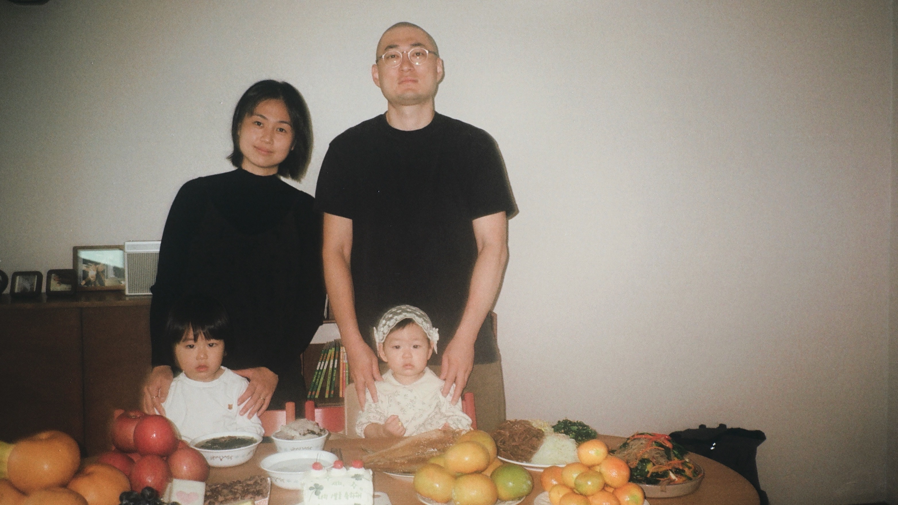

“해리포터에서 해리가 계속 성장하고 막강한 빌런하고 대척해나가고 질 것 같은 싸움에서도 죽지 않고 살아남는 이유 중에 큰 것은, 해리의 부모님이 해리가 어렸을 때 정말 깊은 사랑을 주셨다는 거예요. 그런 종류의 사랑은 어떤 흔적을 남긴다는 말이 있잖아요. 이 아이의 영혼에 무언가 남겨서, 평생을 따뜻하게 밝히는 불빛처럼 남아, 힘을 준다는 게 저는 너무 좋았거든요”

오늘 아침 오디오 매거진에서 들은 저 말이, 토시 하나 놓치는 것 없이 다 들린 저 말이, 그냥 왜인지 오늘이 시와 생일이라서, 선물 같았다. 첫번째 생일을 축하해 귀여운 와와야 ! :)

