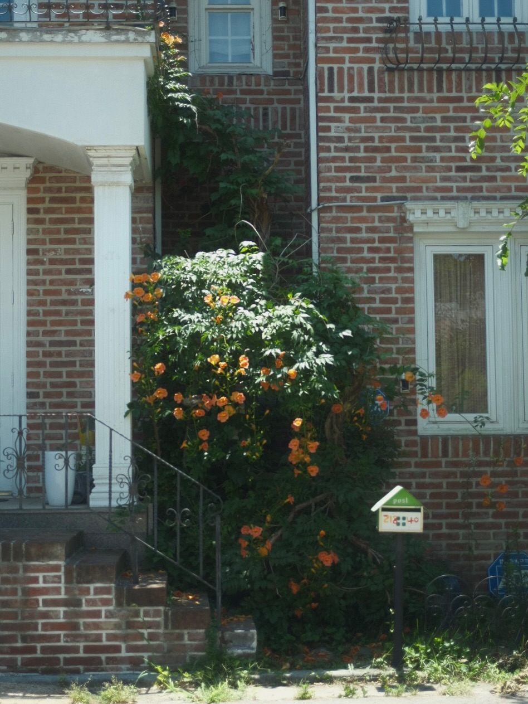
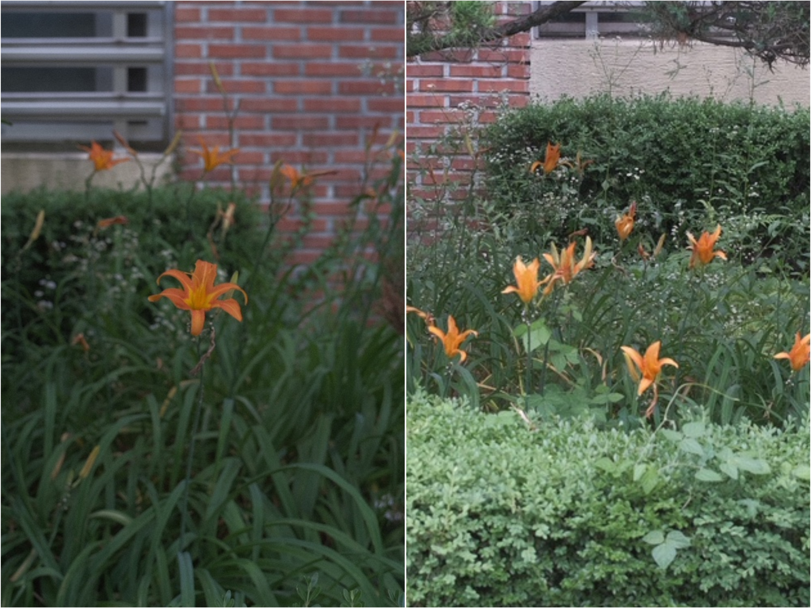

**‘나’의 여름 경험과 감각을 기록하시오.**

재미있는 프로젝트에 참여하게 되었다. 누구나 신청할 수 있고 모두 다 참여할 수 있는 오픈콜 형식이지만 개인적으로는 ‘나’의 기록을 대외적으로 발표하는 자리가 마련된 셈이니 괜히 귀하고 설렌다. 기록은 늘 해오던 거지만 주제를 정하고 고민하는 건 아주 오래간만이라 이리저리 겉도는 기분이다. 그래도 이참에 최근 촬영한 몇 장의 사진과 여름에 대한 짧은 단상을 적어보면,

올해 여름도 역시, 내가 기대했던 것보다 훨씬 더 무덥고 뜨겁고.. 그렇다.
집 앞 화단에 핀 원추리는 아침에 피었다가 저녁에 지고 마는데, 그 맞은편 배롱나무는 백일동안 계속 꽃을 피운다. 원추리의 여름은 한나절이고 매미의 여름은 일주일이고 배롱나무의 여름은 삼개월 남짓.

‘날이 참 덥지요’ 하는 인사가 정해져 있어서 얼마나 편리한가. “저는 이런 날씨 좋아해서요, 푹- 절여지는 기분이랄까?” 하며 긍정적으로 대답할 수 있는 나는 또 얼마나 쿨한가.

창문 다 열어두면 살-랑 맞바람이 이는데, 그 바람이 적당히 뽀송하고 선선하기라도 하면 참으로 행복해지는 계절. 무엇이 주제가 될 지는 아직 모르겠지만, 일단 미놀타 x700 다시 꺼냈고 흑백필름 넣었으니 여름을 담아보자 !

