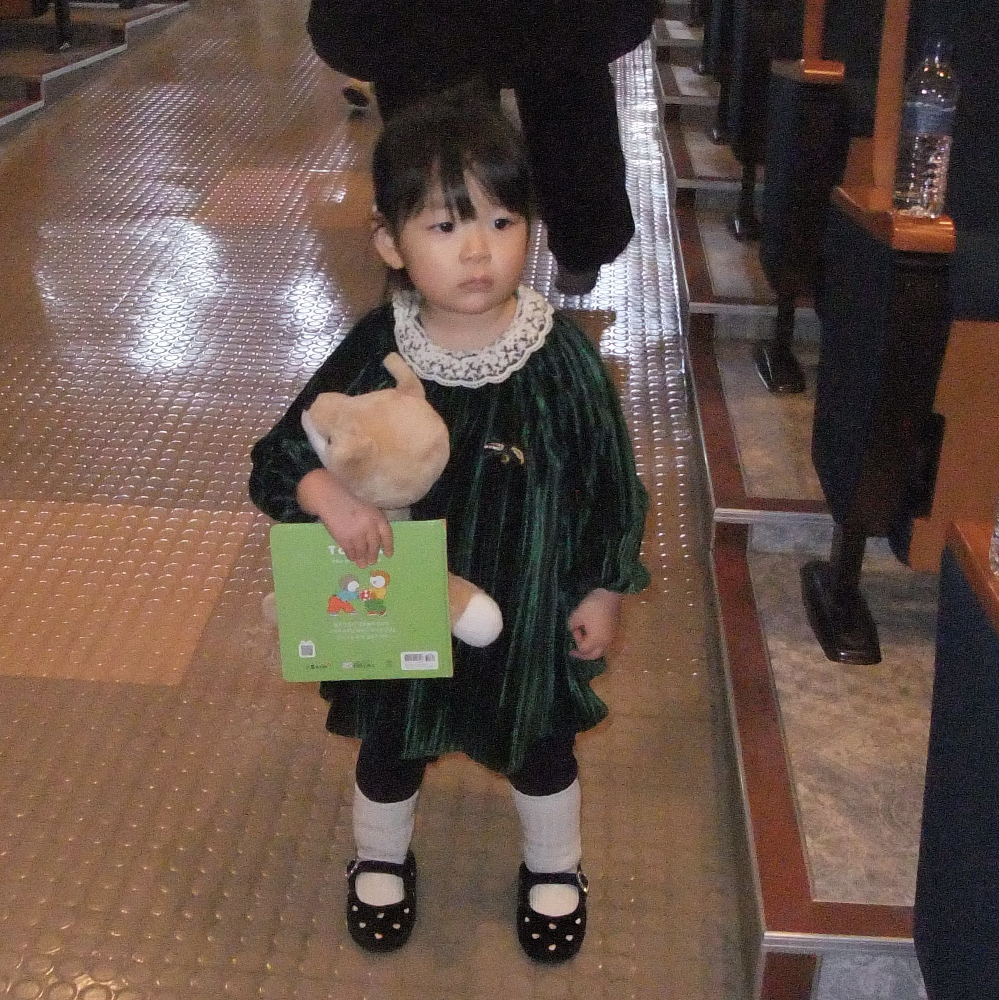

깍두기 유치원생으로 한 살 많은 누나 형들과 같은 반에서 한해를 보낸 결이가, 그들과 무대에 올랐을 때. 누나 형들 옆에서 전혀 뒤쳐짐 없이 같은 퍼포먼스를 보여주는 모습을 보자마자 눈물이 왈칵 쏟아졌다. 감격인지 감동인지 미안한 마음인지 대견한 마음인지 모를 수많은 감정이 한꺼번에 덮쳐왔던 것 같다. 오빠 따라 꼬까옷 입고 잔치에 놀러온 시와도 이날이 특별했기를.

재롱 잔치가 끝나고 엄마와 짧게 통화했다. 아니 어쩌면 우리 결이는 그래? 하는 나의 자랑 섞인 질문 비슷한 것에 우리 엄마는, "너도 그랬어, 다들 너 칭창만 했어. 뭐든 해내는 애였다고. 뒷받침만 좀 되었어도... 결이는 잘 이끌어줘라"

치 미워.

