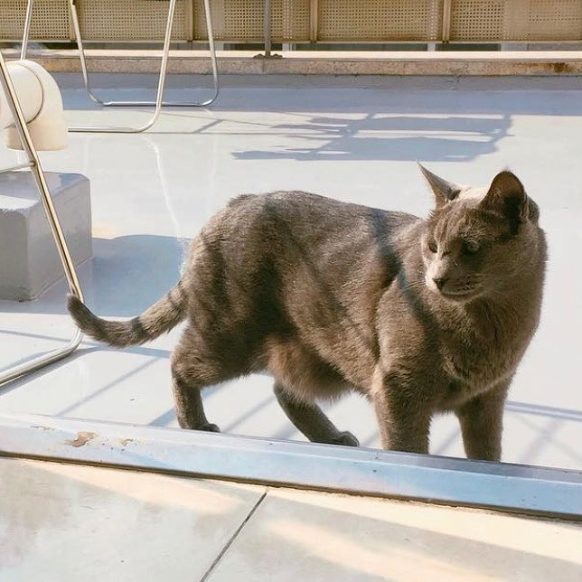
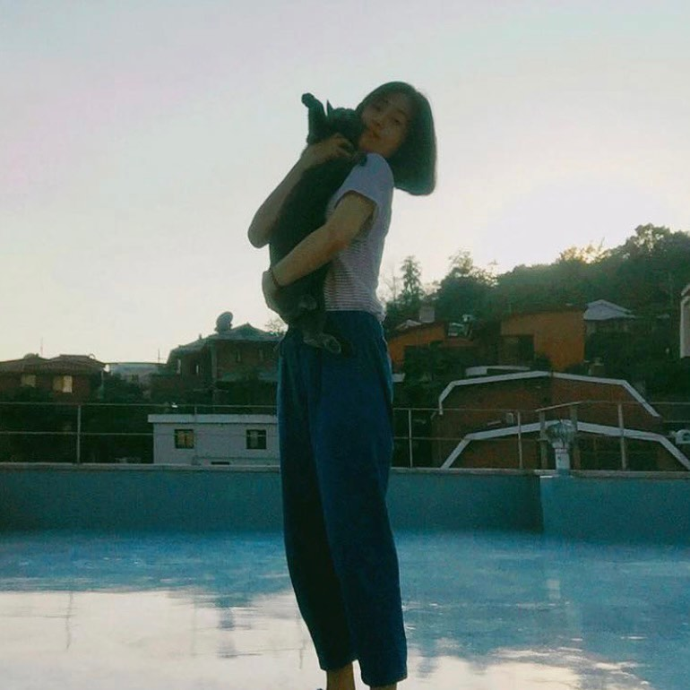
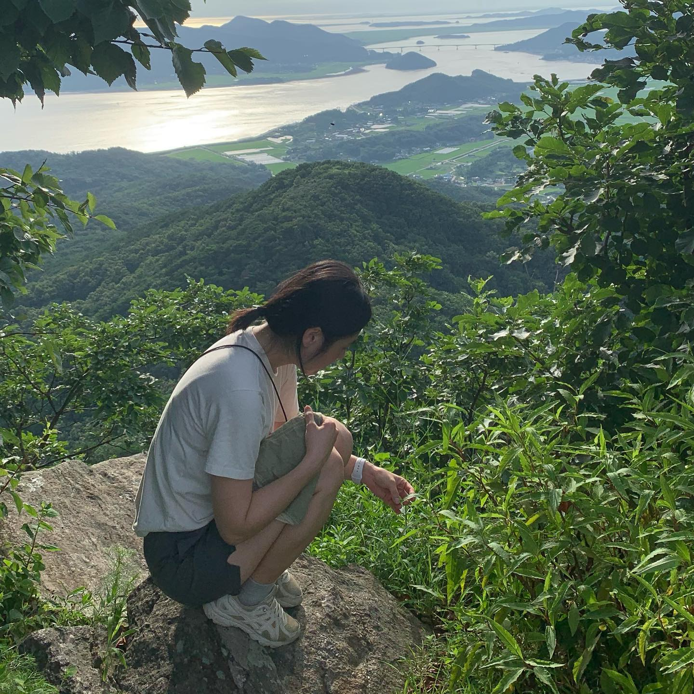

계절이 네 번 바뀌는동안 사과를 보러가지 않았다는 사실에 놀라 우리 부부는 계획없이 강화도로 출발했다. 벌써 사과를 보낸 지도 삼년하고 삼개월이 지났다. 우리가 살던 강화도 마을의 뒷산인 진강산은, 해발 사백사십삼미터의 높지 않은 산임에도 불구하고 오르는 이들이 적어 수풀이 우거지고 길이 험준하다. 그곳 정상에 우리 사과가 있다. 사과를 만나러가는 길은 언제나 만만치 않은데, 그 모든 과정이 그저 즐겁고 신난다. 매번 다녀올 때마다 하는 말이지만, 이동장에 들어가는 걸 끔찍이도 싫어했던 아이었는데 땅에 묻은 것이, 그 높은 곳에 혼자 둔 것이, 더 자주 찾아가지 못하는 것이 모두 미안하다. 그립고 보고싶다 우리 사과. 자주 올게. 미안해.

