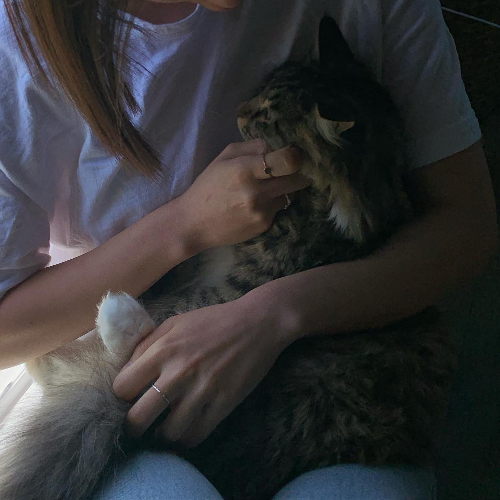

어느날 꿈에, 친구네에서 놀다 집에 가려고 현관문을 열었더니 문 앞에 오공이가 앉아 있었다. 내가 나오기만을 기다린 아이처럼 두 팔을 꼬리로 감싸안은 채, 나를 올려다보고 있었다. 아직도 그 눈빛이 선명하게 기억이 날만큼 예뻤다. 그 아이를 꼭 끌어 품에 안았고, 집으로 돌아가는 동안 우리는 꽃과 나비를 구경했다. 

​
태몽이구나 싶었다. 새로운 고양이 친구를 항상 경계 없이 받아주고, 모든 사람 친구들에게 관대하며, 처한 상황에 적응이 빠르고, 욕심 없이 귤에게 기꺼이 모든 것을 양보하는 우리 오공. 오공이를 닮은 아이가 찾아온 거구나, 생각했다.

​

